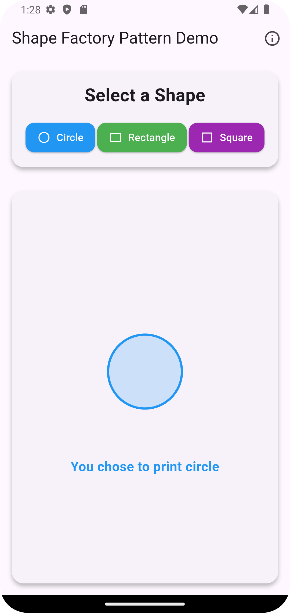
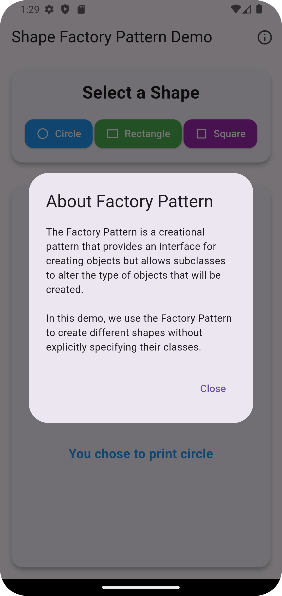

# Shape Factory Pattern Demo

A Flutter application demonstrating the Factory Design Pattern using shape creation. This project showcases how to implement a factory pattern to create different shapes (Circle, Rectangle, and Square) with smooth animations and a modern UI.

## 📱 Screenshots


| Main Screen | Info Dialog |
|---|---|
|  |  |

## 🎯 Features

- Implementation of Factory Design Pattern
- Three different shapes: Circle, Rectangle, and Square
- Animated shape transitions
- Error handling with visual feedback
- Loading states
- Modern and clean UI
- Informative tooltips

### Design Pattern Implementation

The project uses the Factory Pattern with the following structure:

1. **Shape Interface**
```dart
abstract class Shape {
  String revealMe();
  Color get color;
  IconData get icon;
  String get name;
  Widget buildShapeWidget();
}